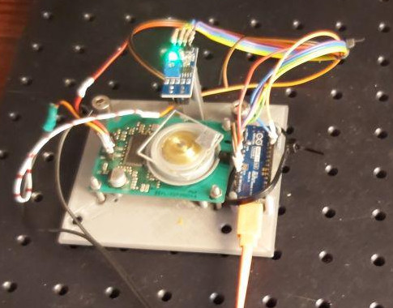
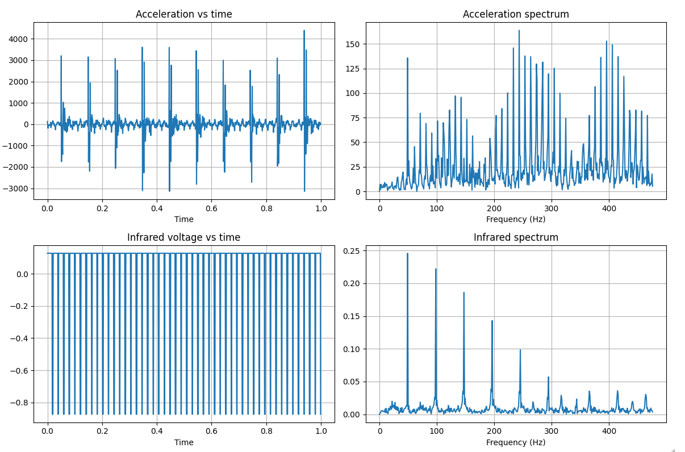
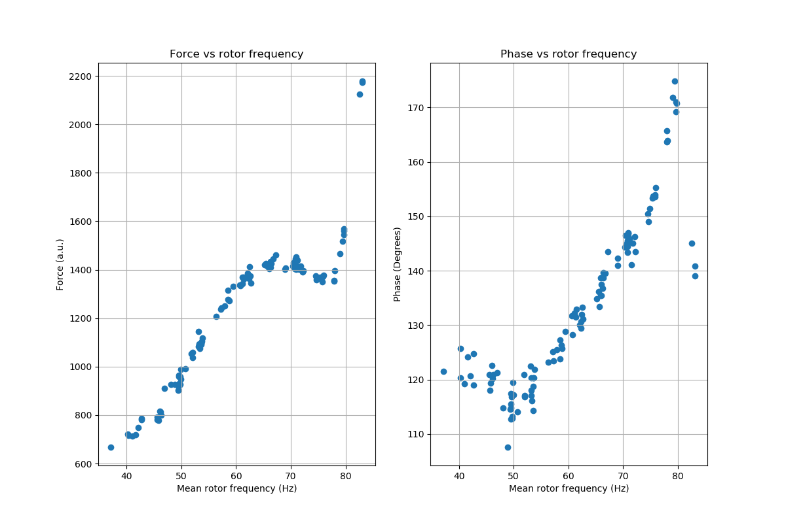

# Rotor balancer
The rotor balancer can be used to balance propellers from flying drones or laser mirror motors.
The instrument is also a tachometer and can record the speed of rotors. The Nano 33 BLE is used to pulse the motor via hardware pwm and record the accelerometer signal via the onboard LSM9DS1 accelerometer chip.
During rotation the signal of a [TCRT5000 IR LED](https://opencircuit.nl/Product/TCRT5000-Infrarood-lijn-detectie-module) is read out to detect the position of the rotor.
The amplitude of the accelerometer signal is proportional to the unbalanced mass. The phase difference between the infrared LED and the accelerometer indicates the position where a balance weight, aka. putty, has to be placed.
In the case of two plane unbalance, the phase difference between the IR Led and the accelerometer can be dependent upon rotor speed. <br>


# Installation
Compile the firmware with the Arduino IDE or Platform IO and upload it to the Arduino Nano 33 BLE.
Connect to the board with a baudrate of 115200. Five options are available; start samples, calibrate IR sensor, spin polygon,
check pulse frequency and set pulse frequency. <br>
Place an aluminum foil sticker on your rotor. Check if the IR sensor can detect the sticker and set the threshold using a screwdriver on the TCRT5000 IR LED sensor so it only changes when it detects the sticker. Use other menus to check if the polygon is spinning and set the pulse rate. Menus can typically be exited by pressing the 1 key and sending it with enter.
A program to collect measuremetns has been made available in python 3. <br>
Install requirements;
```console
pip install -r requirements.txt
```
Program can be run as follows;
```console
python main.py --plot --frequency 20 --filename '20hertz.p'
```
Example measurements can found in the measurements folder. 

# Measurements
<br>
For each measurement, the rotor was pulsed at a certain frequency for 20 seconds.
The motor was then turned off and the acceleration and infrared signal were measured over time.
This was done as the the motor interfered with the measurements. Turning the motor of resulted in cleaner results.
Sampling is equidistant at 952 Hertz as this was the maximum sampling frequency of the accelerometer.
From the measurements it can be seen that the rotor slows down.
The [centripetal force](https://en.wikipedia.org/wiki/Centripetal_force) is linear proportional to mass.
In single plane balancing it is assumed that the angle of the force is not dependent upon speed. The phase-difference between the ir sensor and the acceloremeter determines this angle. The phase difference and amplitude were determined via the getdetails function in calc.py. Noise was not removed with a bandpass Butterworth filter, as it did not improve results. The minimum and maximum is determined for each cycle. The phase difference between these must be 180 degrees for the measurement to be accurate. The location of the minimum will be the location of the balance weight. The result of another method, where a sinusoid was fitted on tip of the result, showed similar results. <br> 
<br>
The force follows a square law between 40-60 Hertz but not over the whole domain. This could be partly due to 
the fact that the rotor slows down. Other things most play a role as well as there is a noticable change around 78 hertz in both the force and phase plot. <br>
The phase angle between the minimum amplitude of the accelerometer and the peak of the photodiode is dependent upon speed.
This is problably due to the fact that there is multiple plane in balance. Imagine multiple disks with each their own unbalance. If the speed is increased all these unbalances will scale linearly. 
Their moment is dependent upon the distance to a pivot point which is different. As a result, the angle of the force measured can be dependent upon speed. <br>
The measurements were done on prism for which some balancing was already done. A balance weight of 0.060 gram [Weicon resin putty](https://www.weicon.de/en/products/adhesives-and-sealants/2-component-adhesives-and-sealants/epoxy-resin-systems/plastic-metal/298/epoxy-resin-putty) was applied. I used an AG204 Delta range from Mettler to measure the weight of the putty accurately. An alternative is to cut of pieces of aluminium tape. Futher literature can be found in [Science direct](https://www.sciencedirect.com/science/article/pii/S2351988616300185) and at the site of [National Instruments](https://forums.ni.com/t5/Example-Programs/Two-Plane-Balancing-Example-with-DAQmx/ta-p/3996066?profile.language=en).
The measurements are available in the measurements folder. The code for the analysis is available in test.py.


# Implementation details
I had to remove modemmanager as this caused problems with [arduino](https://forum.arduino.cc/index.php?topic=575194.0).
```console
sudo apt --purge remove modemmanager
```
The accelerometer libary from [Sparkfun](https://github.com/sparkfun/SparkFun_LSM9DS1_Arduino_Library) is used in a slightly modified form.


# BOM
Prism:<br>
4 sides, 30x30x2 mm <br>
Mirror motor: <br>
Panasonic AN4000A, other moters require different pins to be pulsed <br>
Accelerometer: <br>
The accelerometer of the LSM9DS1 is used, as it available on the Arduino Nano 33. <br>
IR sensor: <br>
The TCRT5000 IR LED sensor see [DIY LP turntable](https://www.stockholmviews.com/wp/diy-lp-turntable-tachometer/). I bought one [here](https://opencircuit.nl/Product/TCRT5000-Infrarood-lijn-detectie-module) <br>
Balancing putty: <br>
In the industry two systems are used. A 2 component epoxy resin putty by [Weicon](https://www.weicon.de/en/products/adhesives-and-sealants/2-component-adhesives-and-sealants/epoxy-resin-systems/plastic-metal/298/epoxy-resin-putty)
A single component UV curable expory resin system, e.g. by [Shenk](http://www.schenck-worldwide.com/PDF/de-de1/Epoxidharz-Unwucht-Korrektursystem.pdf). In german it is called Wuchtkitt. The compound has a ceramic filling and the density is 2 gram per cubic centimer. Component was ordered via [modular](https://www.modulor.de).
An alternative is to use lead or metal tape. Lead has a density of 11 gram per cubic centimer. <br>
Optical plate: <br>
Used an optical aluminum breadboard from Thorlabs with M6 screws as base. Do not attach the device to something heavy this make the measurements worse. Typically, you want it decoupled from the external world and place the object under study on foam or hang it on cords. During measurements, the prism was suspended in air with strings.
